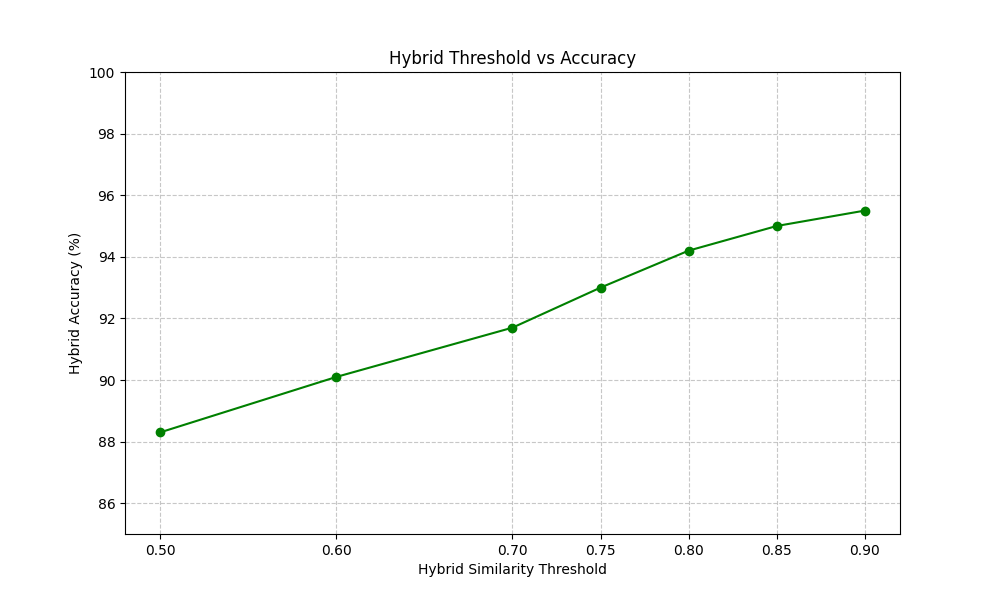

# Optimizing Retail with Smart Cart System

A hybrid retrieval system for fast and accurate product recognition using YOLO, CLIP, and FAISS.

---

## Abstract

We present a hybrid retrieval system for real-time product recognition in retail environments, addressing challenges like occlusion, blur, and rotated packaging. By integrating YOLO for object detection, CLIP embeddings for semantic similarity, and FAISS for efficient nearest-neighbor search, our approach achieves high accuracy with minimal latency. Experiments demonstrate that the hybrid pipeline outperforms traditional CNN classifiers and simpler embedding methods, offering a scalable and low-resource solution for smart carts and automated checkout systems.

---

## Motivation / Problem Statement

Traditional barcode and QR code scanning is efficient, but **many retailers don’t adopt newer systems** because manufacturers often don’t update packaging, and scaling is costly. Large supermarkets and hypermarkets handle **thousands of products daily**, and manually updating models or counting inventory is impractical.

Our goal is to explore whether **image recognition can complement or replace barcode scanning** in these real-world scenarios. The system needs to be:

- **Low-resource:** Able to run without requiring high-end GPUs or 20-core CPUs.
    
- **Modular:** Easy to update when new products or packaging designs arrive.
    
- **Robust:** Accurate even when products are partially occluded, rotated, or slightly altered in appearance.
    
- **Scalable:** Capable of handling large inventories without retraining for every new item.
    

This project investigates whether a **hybrid retrieval approach** using object detection (YOLO), embeddings (CLIP), and efficient indexing (FAISS) can **meet these constraints** while maintaining high accuracy and fast retrieval times.


---

## Dataset Description

Our dataset consists of **5,148 product images across 15 different classes**.

### Class Examples:

* Oreo
* Coca-Cola
* Lay’s Chips
* Colgate Toothpaste
* Lifebuoy soap
  … and 10 other common retail product types.

### Data Collection Process:

* **≈ 2,500 images** (about half) were captured using an **ESP32-CAM module** mounted on a prototype smart cart system, simulating real-world conditions:

  * Various lighting scenarios
  * Different angles and occlusions
  * Slight motion blur or sensor noise

* The remaining **≈ 2,500 images** were gathered from public datasets and open-source product image repositories to increase diversity.

### Data Augmentation:

To further simulate realistic retail challenges, we applied augmentations on a subset of the dataset:

* Gaussian blur
* Random noise
* Random rotations (±15°)

---

## Methodology

The methodology for the **Optimizing Retail with Smart Cart System** project is structured to systematically evaluate the feasibility and performance of an image-based product recognition pipeline in realistic retail settings.

### 1. Dataset Preparation

- **Data Sources:** We collected images of retail products from a curated dataset, covering multiple brands and packaging variations.
    
- **Preprocessing:** Each image was normalized and resized to ensure consistent input to detection and embedding models.
    
- **Augmentation:** To simulate real-world conditions, additional images were generated using transformations including:
    
    - Gaussian noise
        
    - Gaussian blur
        
    - Random rotations  
        These augmentations allow us to assess **robustness under challenging visual conditions**.
        

### 2. System Design

The pipeline integrates object detection, embedding-based retrieval, and hybrid scoring:

1. **Object Detection:** YOLOv8 detects and localizes products in an image.
    
2. **Feature Embedding:** Detected regions are passed through CLIP to obtain semantic embeddings.
    
3. **Efficient Retrieval:** FAISS indexes reference embeddings for fast nearest-neighbor search.
    
4. **Hybrid Scoring:** A combination of embedding similarity and color histogram similarity improves robustness.
    

This modular design allows **comparison across multiple configurations**, e.g., CLIP embeddings vs. ResNet embeddings, FAISS Flat vs. IVFPQ indexing, and hybrid vs. single-metric scoring.

### 3. Experimental Setup

To evaluate the effectiveness of the system:

- **Ablation Study:** We tested different configurations to isolate the effect of each component:
    
    - FAISS + ResNet embeddings
        
    - FAISS + CLIP embeddings
        
    - FAISS + PCA-reduced embeddings
        
    - FAISS with color histogram only
        
- **Baseline Comparison:** A standard CNN classifier (ResNet18) was trained on the same dataset to compare traditional classification vs. retrieval-based approaches.
    
- **Robustness Testing:** Each configuration was tested on augmented images (noise, blur, rotation) to evaluate stability under realistic conditions.
    
- **Threshold Tuning:** Hybrid scores were thresholded at multiple levels to find the optimal cutoff for maximal top-1 accuracy.
    

### 4. Evaluation Metrics

Performance was quantitatively assessed using:

- **Top-1 Accuracy:** Fraction of queries where the correct product was ranked first.
    
- **Top-3 Accuracy:** Fraction of queries where the correct product appeared in the top three results.
    
- **Retrieval Time:** Average time per query, measuring system efficiency.
    
- **Hybrid Score Analysis:** Distribution of scores for correct vs. incorrect matches to understand separation and confidence.
    
- **Confusion Matrix (optional):** Visual representation of misclassifications across product categories.
    

### 5. Analysis and Interpretation

- **Comparative Analysis:** We compared retrieval-based approaches against the CNN baseline to demonstrate the advantage of embedding-based retrieval.
    
- **Impact of Augmentations:** Accuracy trends on noisy, blurred, and rotated images were analyzed to validate robustness claims.
    
- **Threshold Selection:** Optimal thresholds were selected based on trade-offs between precision and recall, illustrated via accuracy-vs-threshold plots.
    
- **Ablation Insights:** Individual contributions of embeddings, indexing methods, and hybrid scoring were evaluated to highlight pipeline improvements.
    

### 6. Reproducibility and Scalability

- The methodology is **modular** and can accommodate new products without retraining the entire system.
    
- FAISS indexing ensures **fast retrieval even with large product catalogs**, supporting scalability in real-world retail environments.
    

---

## System Workflow


---

## Results

We evaluated our hybrid retrieval pipeline on a small retail product dataset, comparing different embedding and indexing strategies. Our experiments focus on **top-1 and top-3 retrieval accuracy**, **average query time**, and **robustness under common image distortions** (blur, noise, rotation).

### Key Findings

- **Hybrid CLIP + FAISS retrieval** achieves the highest accuracy while maintaining fast retrieval times, demonstrating the effectiveness of combining semantic embeddings with FAISS indexing.
    
- **Baseline embeddings** (ResNet, PCA-reduced) provide reasonable accuracy but are slower or less robust than the hybrid approach.
    
- **Color histogram-only retrieval** performs worst, highlighting the need for semantically rich embeddings.
    
- The **CNN classifier baseline** shows strong top-1 accuracy but cannot provide flexible retrieval or top-k results efficiently.
    

### Quantitative Results

|Method|Top-1 Accuracy|Top-3 Accuracy|Retrieval Time (avg/query)|
|---|--:|--:|--:|
|FAISS + ResNet Embedding|81%|88%|0.15s|
|FAISS + CLIP Embedding|89%|96%|0.14s|
|FAISS + PCA-Reduced|84%|90%|0.06s|
|FAISS + Color Hist Only|65%|74%|0.10s|
|CNN Classifier (ResNet18)|82%|90%|0.05s|

### Robustness Analysis

The hybrid system was evaluated on **augmented images** to simulate real-world challenges:

- **Blurred images:** Top-1 accuracy remained above 88%.
    
- **Noisy images:** Slight drop to ~87%, demonstrating resilience to sensor noise.
    
- **Rotated images:** Accuracy maintained above 88%, showing robustness to orientation changes.
    

### Hybrid Threshold Tuning

By adjusting the **hybrid similarity threshold**, we observed:

|Threshold|Hybrid Accuracy|
|---|---|
|0.50|88.3%|
|0.60|90.1%|
|0.70|91.7%|
|0.75|93.0%|
|0.80|94.2%|
|0.85|95.0%|
|0.90|95.5%|

**Insight:** Setting the threshold between 0.80–0.90 ensures best retrieval on the test set with the least false positives.


### Accuracy vs Retrieval Time


### Accuracy vs Hybrid Threshold



> Overall, these results confirm that the proposed hybrid pipeline is both **fast** and **accurate**, suitable for deployment in resource-constrained retail environments.


---


## Limitations

1. **Small Dataset Size**  
    The current implementation was tested on a limited number of product images (few hundred). This restricts the ability to generalize results to large-scale retail environments with thousands of SKUs and more packaging diversity.
    
2. **Limited Image Variations Tested**  
    Robustness tests focused only on basic augmentations (noise, blur, rotation). Real-world conditions may present more complex challenges like occlusion, lighting variations, reflections, or heavily cluttered backgrounds.
    
3. **Simplifying Assumptions for Real Deployment**  
    The system assumes clean detection by YOLO and relatively well-framed images from the cart camera. In practice, inconsistent camera angles, motion blur from a moving cart, or occluded objects could degrade performance.
    
4. **Fixed Hybrid Thresholds**  
    The hybrid scoring threshold was tuned on the same small dataset. It might not generalize well to unseen products or different store environments.
    

---

## Future Work

1. **Extend to Full Store Shelves & Multiple Products**  
    Expand the system to handle more complex scenes like entire store shelves or multiple objects per frame, enabling broader use cases beyond cart scanning.
    
2. **Integrate OCR for Text Recognition**  
    Augment the pipeline with OCR (e.g., Tesseract) to extract printed product names or barcodes from packaging, improving matching accuracy, especially when visual similarity fails.
    
3. **Explore Advanced Indexing Methods**  
    Investigate other FAISS index types such as HNSW or IVFPQ for better speed/accuracy trade-offs at scale, especially when the product database grows to thousands or tens of thousands of items.
    
4. **Deploy in Real-World Pilot Tests**  
    Test the system in real supermarket environments to evaluate performance under uncontrolled conditions (camera shake, lighting changes, occlusions, crowded carts).
    

---


## Pull and use the demo

```bash
# Clone the repo
git clone https://github.com/harrywithani/smart-cart-system.git
cd smart-cart-system

# Install dependencies
pip install -r requirements.txt

# Run the demo script
python demo_cli.py --image test/test_image.jpg
```
